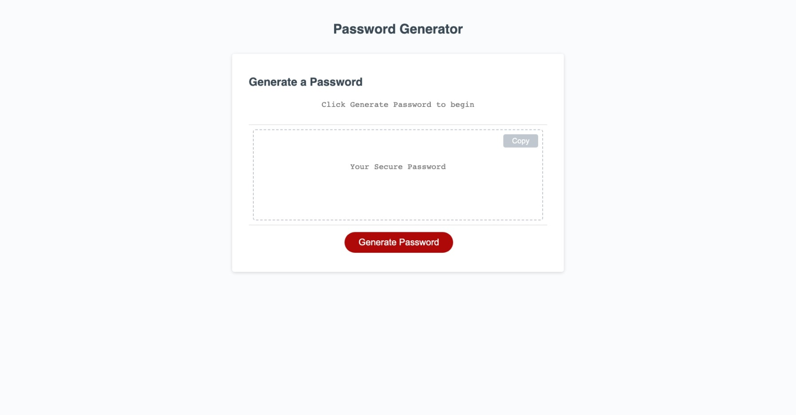
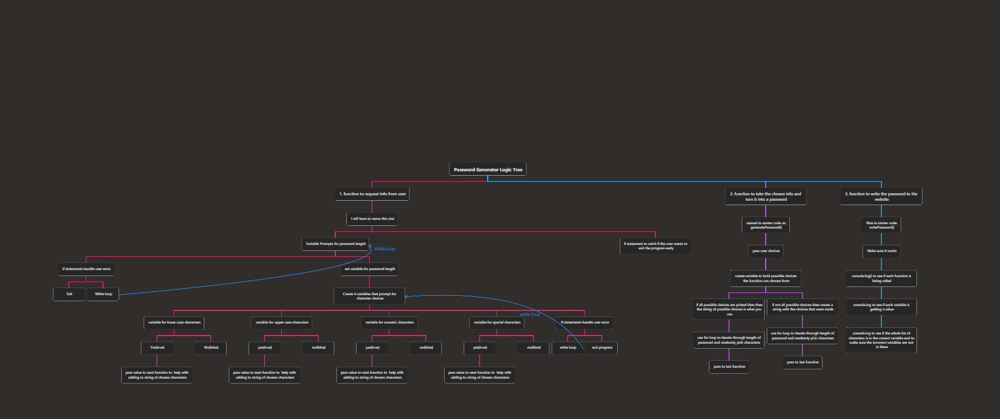
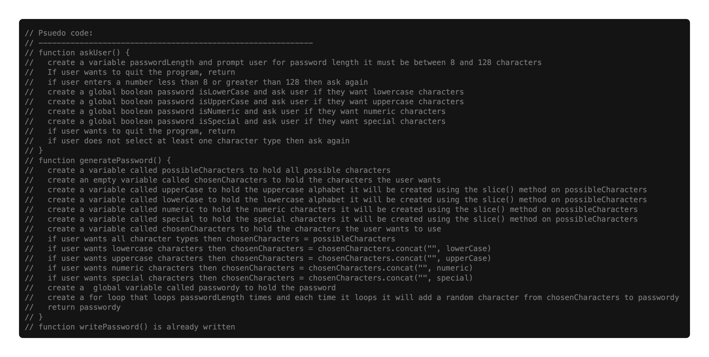

# Password Maker

## Description

An application that generates random passwords based on criteria that the user has selected. Not every website will accept the standard randomly generated passwords created by my phone. I wanted to create a site that would help in situations when I need a random password that has unusual criteria. This will solve the dialemma I face when making a password for a website with very specific rules. I learned about planning my code before I create it.

## Usage

You click the red button and follow the pop-up prompts till it gives you the password.

[Link to application](https://lesley-byte.github.io/password-maker/)

## My Creative Process

I started the creative process for making the JavaScript on this website with drawing a mindline/simplified flow chart like this:

After that I wrote pseudocode to work out what should happen.

## Credits

The Rutgers Full Stack Coding Bootcamp program with the fantastic instructors, tutors and graders really helped me with this. I am grateful.

## License

MIT License

## Badges

## Features

- html
- css
- JavaScript
- Pseudo code in the js file
- Lots of comments in the js file
- Console.log() to test code shows when you inspect the page
- Effort

## Tests

Try to exit it gracefully. See how it handles user error.
